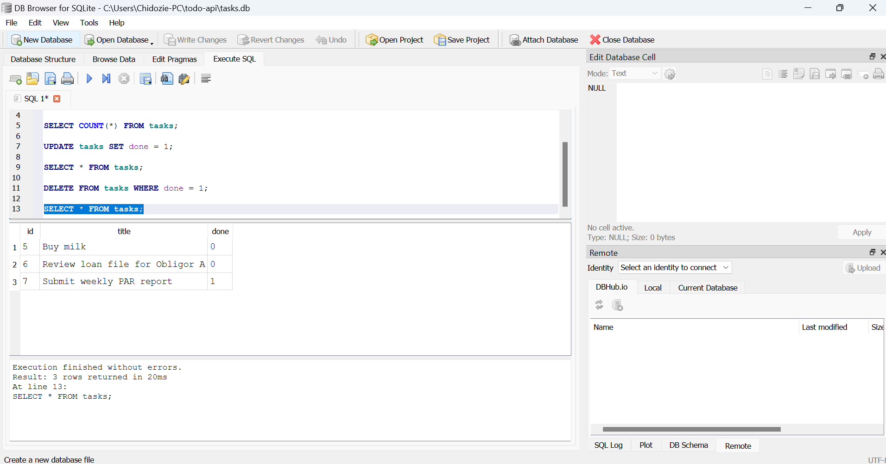
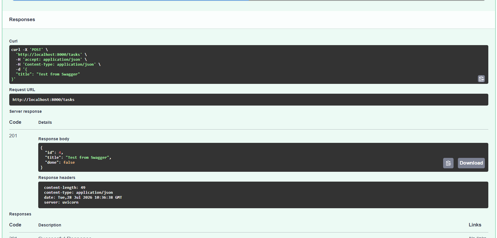

# Task API

A small CRUD API for managing a to-do list, built with FastAPI. Built as part of [Backend AI Engineering/https://internship.flyrank] — this is a learning project with in-memory storage only, no [...]

## How to run it

1. Clone this repo and enter the folder:

  git clone https://github.com/favour79/todo-api.git

  cd todo-api

2. Create and activate a virtual environment:

  python -m venv venv

  venv\Scripts\activate      (Windows)

  source venv/bin/activate   (Mac/Linux)

3. Install dependencies:

  pip install fastapi uvicorn

4. Run the server:

  uvicorn main:app --reload

5. Open http://localhost:8000/docs to see and test the API in Swagger UI.

## Endpoints

| Method | Path              | Description                          |

|--------|-------------------|---------------------------------------|

| GET    | /                 | API info                              |

| GET    | /health           | Health check                          |

| GET    | /tasks            | List all tasks                        |

| GET    | /tasks/{task_id}  | Get one task by id                    |

| POST   | /tasks            | Create a new task                     |

| PUT    | /tasks/{task_id}  | Update a task's title and/or done     |

| DELETE | /tasks/{task_id}  | Delete a task                         |

## Database

This project now uses SQLite instead of an in-memory list. SQLite was chosen because it needs no separate server or installation — it's a single file, which is ideal for a learning project at this stage and mirrors how many production systems start before scaling to PostgreSQL or MySQL.

The database file is created automatically the first time the app runs, at:
todo-api/tasks.db

The `tasks` table and 3 example rows are also created automatically on first run. Restarting the server no longer resets your data — this is the core change from Assignment 1.

### Example SQL query

Run directly in DB Browser for SQLite:

SELECT * FROM tasks;

Result:

| id | title                          | done |
|----|--------------------------------|------|
| 5  | Buy milk                       | 0    |
| 6  | Review loan file for Obligor A | 0    |
| 7  | Submit weekly PAR report       | 1    |

### DB Browser screenshot

Note: no extra installation is needed for the database — Python's built-in sqlite3 module handles it.

## Example request

curl -i -X POST http://localhost:8000/tasks -H "Content-Type: application/json" -d "{\"title\":\"Buy milk\"}"

Response:

HTTP/1.1 201 Created

{"id":4,"title":"Buy milk","done":false}

## Swagger UI

Screenshot below shows a successful POST /tasks call tested directly in Swagger UI:

## Notes

Data is stored in memory only — restarting the server resets the task list back to the 3 example tasks. This is intentional for this stage of the project; persistent storage comes later.
